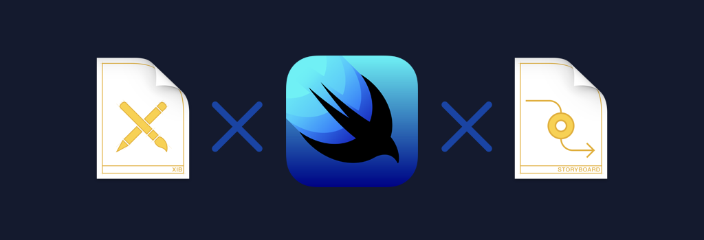

<div align="center">

</div>

# Sample of Preview function by SwiftUI
Introduce how to make the Storyboard file and Xib file correspond to the preview function by SwiftUI.  
You can use SwiftUI preview feature while continuing to support iOS 13 and below!!

# Usage
In order to try the preview feature, you need to select a preview-only target. That's because the target version needs to be iOS 13 or more for the preview feature to work.  
The swift file described for previews is linked to "preview-only target" only.  
If you change the parameter for UIView or UIViewController inside `updateUIView` method, it will be reflected in the preview.

<div align="center">

</div>

```swift
import SwiftUI
import UIKit

#if DEBUG
// Create new for preview
struct UserDetailBasicInfoCellPreviews: PreviewProvider {
    static var previews: some View {
        Group {
            // Sets the format of the preview
            UserDetailBasicInfoCell()
                .previewLayout(.fixed(width: 320, height: 100))
                .previewDevice(PreviewDevice(rawValue: "iPhone SE"))
            UserDetailBasicInfoCell()
                .previewLayout(.fixed(width: 414, height: 100))
                .previewDevice(PreviewDevice(rawValue: "iPhone XS Max"))
        }
    }

    static var platform: PreviewPlatform? = .iOS
}

// UserDetailBasicInfoCell.swift
// UserDetailBasicInfoCell.xib
extension UserDetailBasicInfoCell: UIViewRepresentable {
    typealias UIViewType = UserDetailBasicInfoCell

    func makeUIView(context: Context) -> UserDetailBasicInfoCell {
        return Self.instantiate()
    }

    func updateUIView(_ uiView: UserDetailBasicInfoCell, context: Context) {
        // Make parameter change for preview
    }
}
#endif
```

# Let's try!
There is a layout bug in this sample. Fix bugs quickly using this review feature!

Before | After
---- | ----
 | 

# Information
This is using the actual product. Some images have been replaced with dummy data.

# License
StoryboardPreviewsBySwiftUI is available under the MIT license. See the LICENSE file for more info.
